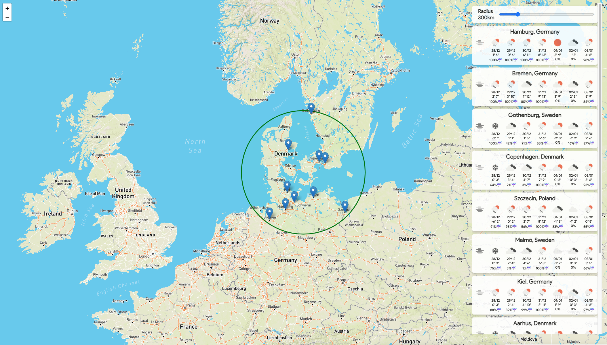

# WhereTo

https://whereto.adrianchifor.com/

Check weather forecast for largest cities in a map radius.

Got a shortlist of cities or areas you want to visit? Next weekend looks free? Use this app to easily filter for the places with the best weather for a mini holiday or citybreak.

Stack:
- Backend: Python3 + [FastAPI](https://fastapi.tiangolo.com/) + [Openweathermap API](https://openweathermap.org/api)
- Frontend: Plain HTML/CSS/JS and [Leaflet.js](https://leafletjs.com/) + [Mapbox](https://www.mapbox.com/) for the map



### Run

```bash
git clone https://github.com/adrianchifor/whereto.git && cd whereto

pip3 install --user 'fastapi' 'uvicorn[standard]' 'slowapi' 'aiohttp' 'expiring-dict' 'jinja2' 'aiofiles'

# Replace the MapBox accessToken
vim static/main.js

OPENWEATHERMAP_API_KEY=your-openweathermap-api-key uvicorn main:app --port 8080

# Visit http://localhost:8080
```

### Deploy to [Cloud Run](https://cloud.google.com/run/)

```bash
export PROJECT=your-gcloud-project

gcloud builds submit --tag gcr.io/$(PROJECT)/whereto:latest . --project $(PROJECT)

gcloud beta run deploy whereto --image gcr.io/$(PROJECT)/whereto:latest \
  --project $(PROJECT) \
  --region your-region \
  --platform managed \
  --allow-unauthenticated \
  --concurrency 30 \
  --timeout 30 \
  --memory 512Mi \
  --set-env-vars=OPENWEATHERMAP_API_KEY=your-openweathermap-api-key
```
